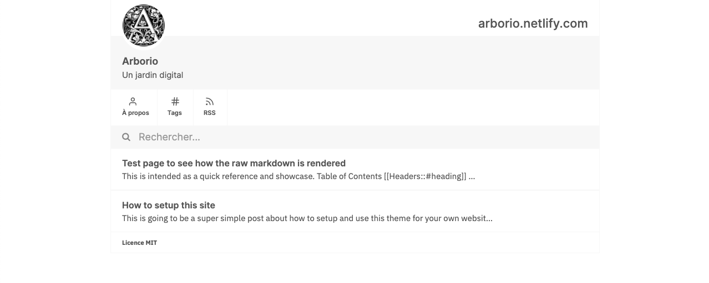

# Arborio

## What is this ?
A digital garden using a custom version of ``simply-jekyll``. It is more oriented on note-taking and aims to help you build a nice knowledge base that can scale with time. 



## What is different ?
- It is translated in french, I indeed take my notes in my mother tongue.

- I got rid of the `_posts/`, which I wasn't using and replaced them with `_notes`. Please write your essays in `_notes/`.

- Some cosmetic changes have been made for better readability. Wider page, larger font.

- There are no comments anymore

## How do I use this ?

Go to [arborio.netlify.com](arborio.netlify.com) and follow the very nice guide written by [raghuveerdotnet](https://github.com/raghuveerdotnet) which I adapted for this fork.

Check [https://simply-jekyll.netlify.app/posts/how-to-use-simply-jekyll-features-on-your-website](https://simply-jekyll.netlify.app/posts/how-to-use-simply-jekyll-features-on-your-website) for more advanced features.

## How do I customize this for my needs ?

Things to modify to make it yours (you can search it in github/'this repository`) :

- Meta content in `_layouts/post.html`:
````html
    <meta content="Un jardin digital" property="og:description">
    <meta content="{{ site.url }}/about/" property="article:author">
````

- The favicon and profile are here:
`assets/img/`

- The main stuff is in ``\_config.yml`` :
````yaml
title: arborio.netlify.com
name: Arborio
user_description: Un jardin digital
notes_url: "https://arborio.netlify.com/"
profile_pic: /assets/img/profile.png
favicon: /assets/img/favicon.png
copyright_name: MIT
baseurl: "/" # the subpath of your site, e.g. /blog
url: "https://arborio.netlify.com/" # the base hostname & protocol for your site, e.g. http://example.com
encoding: utf-8
````

- There's some lorem ipsum in `\aboud.md` to replace

- You may want to change the copyright in `_includes/footer.html`:
```html
<p id="copyright-notice">Licence MIT</p>
```
## What's coming ?

I'll try to add a way to change internal link's rendered text. For instance : [[link to note|text that you see]].


