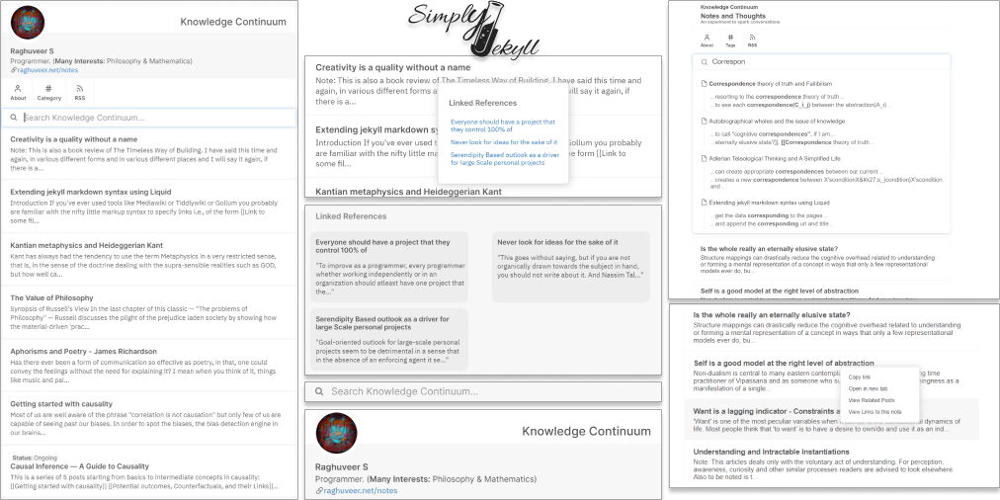

  

    
    
<strong>Simply Jekyll</strong> is a simple yet highly functional jekyll-based theme that combines the best of different worlds. It is a minimal and distraction free theme that strives to provide maximum value all without holding back on any essential features that a user would benefit from or would desire for. This is an evolving project and is garanteed to be maintained at least for quite some time as I myself am a beneficiary of this theme and the project.
 

    
<strong><a href="https://simply-jekyll.netlify.app/">See it in action!</a></strong>

    

## Feature Overview

[View the documentation(f)](https://simply-jekyll.netlify.app/posts/explore) for feature information.

- Based on Jekyll, a static website generator
- Creates backlinks to other notes automatically
- Context menu on feed to instantly see related posts and backlinks
- Search with context integrated within the blog feed
- Supports wiki-style/roam-style double bracket link syntax to other notes
- On hover page previews
- Features a simple and responsive design
- Supports Markdown or HTML notes

## Installation

[View the documentation(i)](https://simply-jekyll.netlify.app/posts/setup) for setup and installation information.

Hopefully there will be an easier process soon.

## Usage

[View the documentation(u)](https://simply-jekyll.netlify.app/posts/usage) for usage information.

## Contributing

Bug reports and pull requests are welcome on GitHub at https://github.com/rgvr/simply-jekyll. This project is intended to be a safe, welcoming space for collaboration, and contributors are expected to adhere to the [Contributor Covenant](http://contributor-covenant.org) code of conduct.

### Submitting code changes:

- Open a [Pull Request](https://github.com/rgvr/simply-jekyll/pulls)
- Ensure all CI tests pass
- Await code review

### Design and development principles of this theme:

1. As few dependencies as possible
2. No build script needed
3. First class mobile experience
4. Make the content shine

## Development

To set up your environment to develop this theme, run `bundle install`.

Your theme is set up just like a normal Jekyll site! To test your theme, run `bundle exec jekyll serve` and open your browser at `http://localhost:4000`. This starts a Jekyll server using your theme. Add pages, documents, data, etc. like normal to test your theme's contents. As you make modifications to your theme and to your content, your site will regenerate and you should see the changes in the browser after a refresh, just like normal.

When the theme is released, only the files in `_layouts`, `_includes`, and `assets` tracked with Git will be released.

## License

The theme is available as open source under the terms of the [MIT License](http://opensource.org/licenses/MIT).

